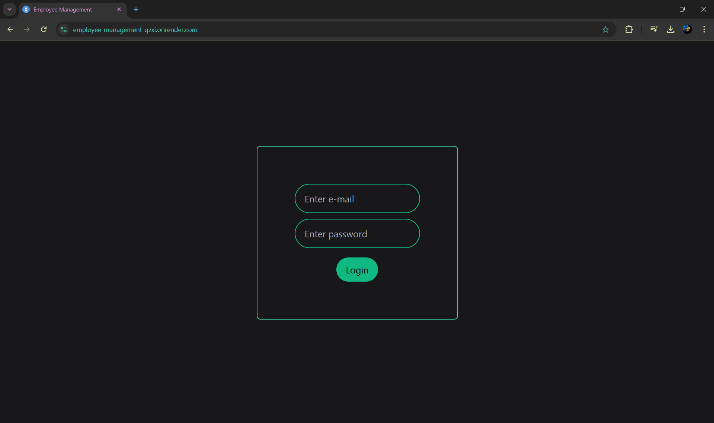
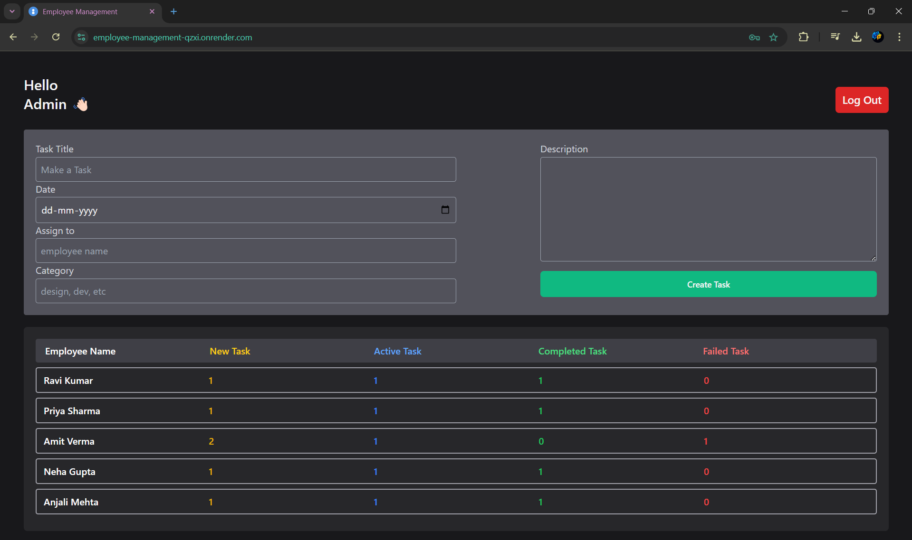
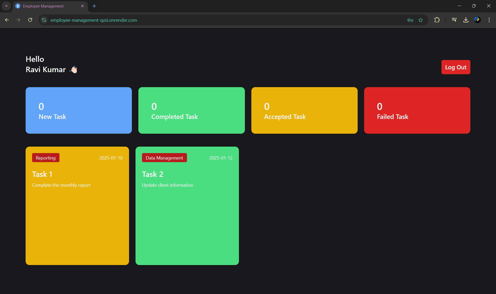

# Employee Management System (EPMS)

A web-based Employee Management System built with **React**. This application allows an organization to manage employee data and tasks efficiently. The system supports role-based access for **Admin** and **Employee** users.

## Live Demo

You can access a live version of the project here: [Employee Management System - Live Demo](https://employee-management-qzxi.onrender.com)

## Features

- **Admin Dashboard**:
  - Create and assign tasks to employees.
  - View all employees and their tasks with different statuses (New, Active, Completed, Failed).
  
- **Employee Dashboard**:
  - View and manage tasks categorized by status (New, Active, Completed, Failed).
  - Accept or complete tasks, or mark them as failed.
  
- **Authentication**:
  - Login system for Admin and Employees.
  - Secure role-based access to features.

- **Task Management**:
  - Create new tasks and assign them to specific employees.
  - Track task status (New, Active, Completed, Failed).
  
- **Responsive Design**:
  - Built with **Tailwind CSS** for a responsive and modern UI.

## Technologies Used

- **Frontend**:
  - React
  - Tailwind CSS
  - Vite
  - React Context API for state management
  - Local Storage for persistent data storage

## Screenshots

### Login Page

### Admin Dashboard


### Employee Dashboard



## Installation

### Clone the repository

```bash
git clone https://github.com/priyanshuk6395/Employee-management.git
```
### Navigate to the project directory
```bash
cd Employee-management
```
### Install the dependencies
```bash
npm install
```
### Run the development server
```bash
npm run dev
```
